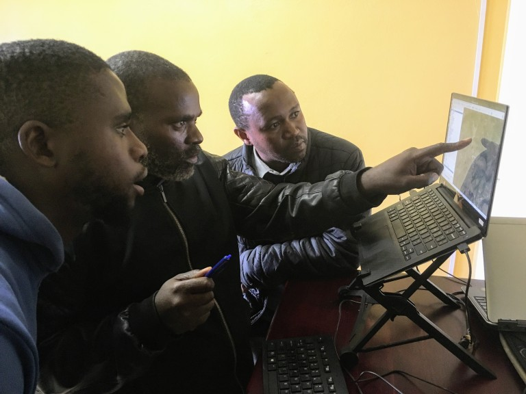
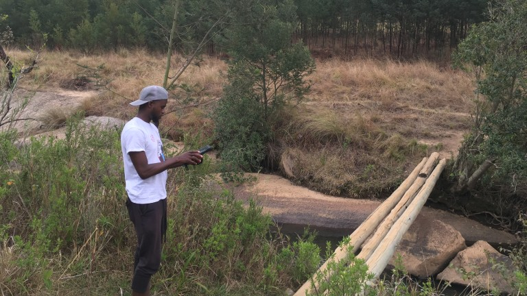
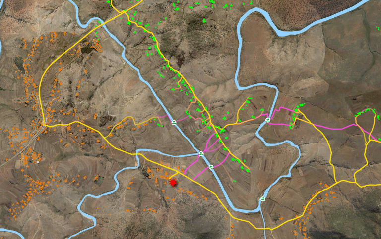

# **Project Background**

Growing from a small, passion-driven project into a large, community-based nonprofit, the [Engineers in Action Bridge Program](http://eiabridges.org) (EIABP) needed to scale its footbridge site survey and assessment operations in order to realize its impact country-wide.

In the early days of the footbridge-building initiative, site identifications occured purely "through the grapevine" --- communities would speak to mayors who would speak to chiefs and so on, until EIABP received word and would then visit and evaluate the site.

While effective, this method proved to be time-consuming, costly and it lacked the efficiency needed to scale to the entire country. Furthermore, the method was non-exhaustive--there were surely some communities who's need was unknown.

Together with EIABP, I designed a scalable assessment methodology, developed a workflow to organize site surveys, and trained four staff members to carry out the field assessments.

**Check out my presentation on the needs assessment at State of the Map 2019!**

`youtube: B6bzW-V0zW4`

Here is how it works:

# **Phase 1: Inkhundla Visit**

eSwatini is administratively divided into 59 _inkhundla_ (states), and each of these inkhundla has a physical building, also called an _inkhundla_, that is the state's head office. Every week all of the _bucopho_ (mayors) for each inkhundla meet together to discuss development.

At these meetings, a EIABP representative makes a presentation about the footbridge projects and how they work both administratively and practically, and then one by one we interview each _bucopho_ for projects that they may need in their constituency.

The _bucopho_ is presented with a satellite map overlaid with points of interest and major roads (QGIS), and then together we locate the position on the map where there is a river crossing in need of a bridge. The crossing location is added to a geodatabase along with basic metadata about the site, and the stakeholder's contact information is entered into an ODK form.

# **Phase 2: Site Visits**

With a list of sites to visit in each inkhundla, a "travelling salesman" route is scheduled to visit the bucophos at each site. EIABP representatives travel with eSwatini government officials in a big loop and arrive at each site to run a preliminary survey.

The preliminary survey is an ODK form designed to be a quick assessment of the technical and social feasibility of a particular bridge site. Some sites are ruled out at this stage due to clear technical incompatibilities with suspended bridge design, or for the community desiring a vehicle bridge, for example.

Once all site visits in a particular inkhundla have been performed, a review of the sites is conducted to determine which sites merit an additional full site survey. This full site survey is another ODK form but is more in-depth both socially and technically and includes an autolevel survey which is necessary for a bridge design.

Each surveyor is equipped with an Android tablet loaded with OSMAnd, an offline orthophoto provided by the eSwatini government, and all the necessary ODK forms.

# **Phase 3: Impact Assessment**

At the end of a data collection campaign for an entire region, an impact evaluation is conducted which aims to understand the social impact of each bridge in order to prioritize their construction.

In addition to all of the social and technical data collected at the in-depth surveys, the impact evaluation is supplemented with accessibility analysis performed using the [tebetebe routing analysis](https://github.com/1papaya/tebetebe) tool, which provides a deterministic understanding of the number of households impacted and the degree of impact for each household.

A summary of all the sites and their impacts are compiled into a report and presentation to eSwatini government officials who make the determination for which bridges are to be built and which order.

# **Results**

Shifting from a "word of mouth" approach to a ground-up community based methodology has improved the efficiency and efficacy of the footbridge site assessments.

1. The number of site surveys performed per day has increased from one to four, on average.
2. Many sites are filtered out upon the first stage of site surveys which saves time on what would otherwise be a lengthy full survey for a clearly infeasible site.
3. By presenting projects directly to community leaders, the expectations for what the projects are and the necessary community involvement has cleared up many ambiguities
4. The assessor tablets, and in particular the offline orthophoto imagery, have been instrumental in the ease of navigation on windy and unmapped backroads
5. As of November 2019, 5 inkhundlas and 75 sites have been surveyed.
