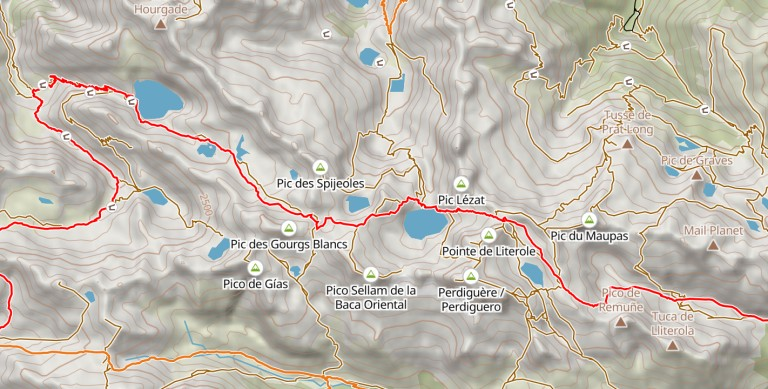
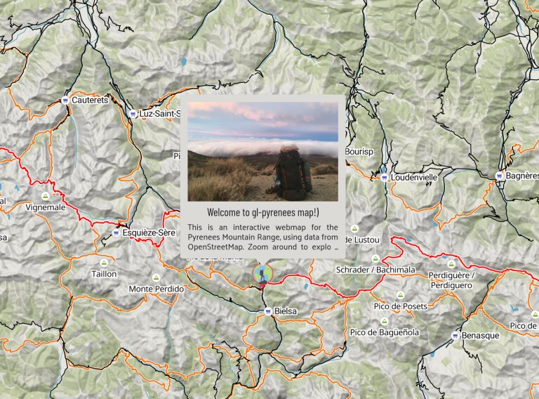
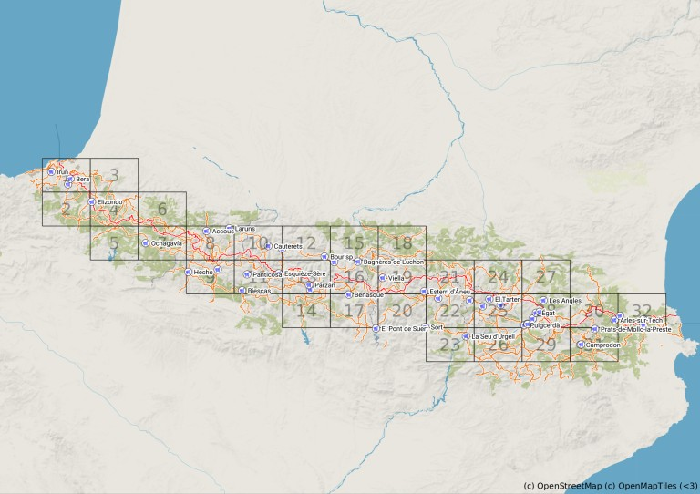

# Project Background

### *"The Mountains are Calling and I Must Go"*

What does it feel like to actually live in the moment? What do you even *do* all day long if you're not constantly working towards the future? When is the last time you just watched the clouds go by?

For me personally: I can't remember. After years and years of analytical thinking on the daily---through engineering school, working as a software developer, being a child of the American rat race---I am so caught up in my thoughts that I could almost be convinced that this is what life is.

But I know it's not. There is more to life than git commits and successful production builds. There are also rocks, trees, and dirt, to name a few.

All my future plans having been cancelled due to the pandemic, I figured this is as good an opportunity as any to leave my laptop behind, follow my short term desires, and bask in sweet synchronicity.

So I decided to backpack the Pyrenees! And to help me prepare I designed and built an online interactive map of all the trails in the region, plus a print version, and coded up a system to update my location as I'm hiking.

# The Map: gl-pyrenees

The interactive map is fully open source and coded together using React Mapbox GL and OpenMapTiles. It's available as [a standalone webapp](https://gl-pyrenees.geodavey.us) and is also exported as a React component [which is published on NPM](https://www.npmjs.com/package/@geodavey/gl-pyrenees).

### Data Sources

The main data source for the interactive map is the almighty OpenStreetMap. Especially for rural roads and hiking routes (the most critical for this map), OSM is likely the most complete data source available. All of the critical basemap features, plus the hiking routes and mountain peaks >3000m, come from OSM.

Searching online about the Pyrenees, I stumbled onto the website [pyrenees-refuges.com](http://pyrenees-refuges.com) which is *amazing*! Apparently there are 1,372 refuges scattered about the Pyrenees and this website has a dataset of them all and is also an association to help maintain them. So cool! Merci beaucoup! :) 

For the supermarkets to resupply, I searched for them using Google Maps, which has the most complete and accurate POI data, and added them to the list of my "Starred Places". I only added supermarkets that looked big so I can be sure to find whatever I need and as cheap as possible.

### Data Preparation

Designing a map for hiking is fundamentally different than a normal streets map. In particular, footpaths and dirt roads ( `highway~path|track` ) hold much more importance.

However, the standard OpenMapTiles spec only includes `highway~path|track` in lower zoom levels (>=12), which isn't ideal in order to get an overview of a hiking route network over a big area.

So, I [forked the OpenMapTiles repo](https://github.com/geoDavey/omt-hiking) and modified the transportation layer SQL to include `highway~path|track` at lower zoom levels (>=10), merged together pbf extracts from GeoFabrik, and built a custom OpenMapTiles tileset.

For the resupply supermarkets, I downloaded the data from [Google Takeout](http://takeout.google.com), which allows you to download your data from Google, including Google Maps Starred Places. I figure that downloading it under this context means the data is my property and that I can include it in the map.

The hiking routes overlay came from OSM [using an Overpass query](https://github.com/geoDavey/gl-pyrenees/blob/master/src/scripts/get-osm-data.js) for route relations `rel[route="hiking"][network~"iwn|nwn"]`

### Map Design

For the Mapbox GL map design, I started with the [default Topo style from MapTiler](https://cloud.maptiler.com/maps/topo/), which includes hillshade and contours layers and was a great starting point.

I decided on using a long-distance hiking route that goes the length of the Pyrenees, the [Haute Route Pyrenees](https://en.wikipedia.org/wiki/Haute_Randonn%C3%A9e_Pyr%C3%A9n%C3%A9enne), as the focal point/"highway" for the map, and the other nearby trails (GR10, GR11, etc) as "side trails".

Since my plan is to avoid civilization, I decided on using pure black for all paved roads, and layered them over the trails so they dominate and it's obvious where to avoid. In doing so I came to realize there is actually a lot of civilization in the Pyrenees---it's not the ["wilderness" that I'm used to](https://www.nps.gov/cany/planyourvisit/maze.htm).

One other neat design feature is that the Peaks >3000m dataset is sorted by elevation before being included in the map, so that in a cluster of peaks only the tallest one is shown at higher zoom levels.

In the end the map style is a bit crowded showing all paths and tracks at higher zooms, but I'd rather that then not show them at all :)

### [Check out the gl-pyrenees GitHub repo here!](https://github.com/geoDavey/gl-pyrenees)

# The Location Updater: caminoBot

While designing the map style, I thought it would be cool to design a way to include live updates on the map. The goal was to build a casual, low bandwidth and no frills solution so I don't have to look at my phone much.

To record a GPS track as I hike would be too much battery, so I decided on building a Telegram bot to send waypoints along the route which can then be routed into a GPS track and added to the map.

### How It Works: Client Side

While I am hiking I keep my phone offline in Airplane Mode. As I'm walking, every once in a while I send a `waypoint` location point to the Telegram bot.

In addition to simple waypoints, I can also send `updates`, which consist of sending a photo with a caption, followed by a location which is associated with the photo.

In both cases, because the phone is in Airplane Mode, the messages are not sent and are instead stuck in the chat and have to be manually resent.

When I get to a point where I have service, I simply send the messages one-at-a-time, in order. In essence, I'm sending the bot a series of "breadcrumbs" and later the dots are connected server-side

### How It Works: Server Side

Once received, the `waypoints` and `updates` are assimilated into a GeoJSON point feature and are added to a FaunaDB database. The `update` photos that are sent from Telegram are uploaded to Cloudinary and the photo URL added to the GeoJSON point properties, along with the caption.

When the bot receives an `update`, it assembles all of the `waypoints` sent since the last `update`, and sends a request to [OpenRouteService's Directions API](https://openrouteservice.org/services/) which calculates the route between the two updates, via each waypoint, with a `foot-hiking` profile. The hiking track is then simplified and added to the FaunaDB `tracks` database as a GeoJSON LineString.

caminoBot also has a `/build` command, which triggers a Netlify Build Hook to rebuild a static site. In my case, sending `/build` will re-build the whole geoDavey.us, which pulls any new data from the FaunaDB database.

The `updates` and `tracks` pulled from FaunaDB are passed to the gl-pyrenees React Component which is visualized on the map, currently hosted at [geoDavey.us/now/](https://geoDavey.us/now/)

### [Check out the caminoBot GitHub repo here!](https://github.com/geoDavey/caminoBot)

# Printed Maps

An online interactive map is cool and all, but do I really want to be looking at a screen while I saunter through alpine zones and skinny dip in pristene Pyrinean lakes? Naww.

Awesomely, just in time for the trip, [QGIS released version 3.14](https://www.lutraconsulting.co.uk/crowdfunding/vectortile-qgis/) which includes native vector tile rendering! And! MapTiler came out with the [MapTiler plugin](https://www.maptiler.com/news/2020/06/say-hello-to-the-new-qgis-plugin/) which makes it super easy to render vector tile maps with Mapbox GL styles directly in QGIS.

Native vector tile rendering in QGIS is *big news*! Especially for printing maps, as maps with vector tiles are now rendered as vector when exported to PDF so they scale *soooo nicely!*. Since the maps are only rasterized the moment they are printed it means the maps will always come out crisp and with no artefacts.

With the QGIS `Create Grid` vector processing tool, I created a grid at 1:sqrt(2) ratio (A4 size) for the whole mountain range, and exported an atlas with 32 regional maps.

In spite of some issues with the plugin (this is new technology after all) the maps came out looking great! Thanks QGIS folks and MapTiler!

### [Download the Pyrenees Map Atlas Here! (120MB)](https://mega.nz/file/lAJBGISZ#mV3ITgiXBiLhMTJIfIl6rFcNn9F1TIgFeVV1-HzzOfw)

# Thoughts for Next Time

* This time around, I built the `gl-pyrenees` basemap as tightly coupled with the location updates from `caminoBot` (ex `<Map data={{updates: []}}>`). In the future I'd like to build separately the map and updates components (ex `<Map><Updates data={[]}></Map>`) so that others can incorporate the map in their projects without the tracking component.
* I will like to create a monorepo `atlas` for all maps projects, to share components in between maps I build in the future! For example, `InfoBox` and `Loader` components can surely be reused.
* The most ideal would be to have a map repository which is entirely self-contained (ie including the contours and hillshade layers, which are currently external resources from MapTiler)

# Other Notes

* Travelling is a privilege and not a right. I'm grateful for the opportunity to do this! &lt;3
* For those curious, the idea of this trip isn't to hike the whole Pyrenees. It's to do whatever I want, all the time. My expectations end once I take the first step :)
* Special thanks to [OSM user Apprit](https://www.openstreetmap.org/user/Appirit) for all their work on the massive HRP route relation! And also thanks to all the OSM communities in France Spain and Andorra for contributing such quality data! Merci Beaucoup / Muchas Gracias / Moltes Gràcies!
* I'm aware there is an ongoing global pandemic. At every step of the way I follow local regulations and minimize my exposure to others. Plus I currently live in Spain so for me this is local travel.