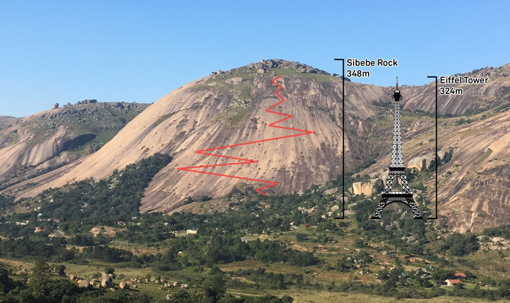
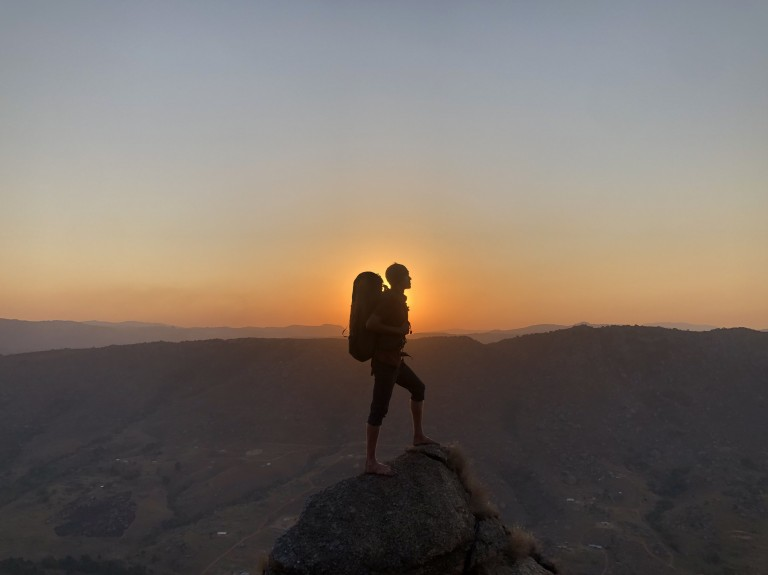

import D3Globe from "../../src/components/svg/d3globe";

# Project Background

Once upon a time I decided to make an icon. I wanted something that represented adventure, and planet Earth.

In those days I was living in Pine Valley, Swaziland, a suburb of the capital Mbabane, in a little pink house down by the river.



In Pine Valley there sits a giant mountain which is also a rock, called Sibebe Rock. It is a point of pride and cultural significance to Swazis, plus it is a pretty darn extraordinary geologic feature.

It's just a big, moderately steep granite mountain. A bit taller than the eiffel tower. I don't know of many like it. It's low key majestic, at sunset even more, and is also a *sick* trail run.

At the time I dreamed of the icon I was living across the street from this big rock, plus one day hosted this awesome Couchsurfer Lilly from Europe. We chatted about the vision and came up with a cool icon shot to take on top of Sibebe.

At sunset we hiked up to the summit and homegirl made it happen for real, got super artsy and we had a full on photoshoot and took a zillion photos. You da Bomb Lilly!

And one of them....was the one!



This image, with a strong edge between the foreground/background is like cake to extract the silhouette, which I did with Photoshop's Quick Selection tool.

# First Rendition: OpenLayers

<OLGlobe
places={[
  { "id": "0", "address": "Denver, CO, USA", "x": -104.9903, "y": 39.7392 },
  { "id": "1", "address": "Boston, MA, USA", "x": -71.0589, "y": 42.3601 },
  { "id": "2", "address": "Mbabane, Eswatini", "x": 31.1367, "y": -26.3054 },
  { "id": "3", "address": "Heidelberg, Germany", "x": 8.6724, "y": 49.3988 },
  { "id": "4", "address": "Alcudia, Spain", "x": 3.124, "y": 39.8533 },
  { "id": "5", "address": "Vilaflor, Spain", "x": -16.6372, "y": 28.1578 }
]}
duration={31000}
onLoad={()=>{ window.dispatchEvent(new Event("resize")) }}
/>

The first rendition I went for the "raster" approach with my tried and tested pals, Photoshop and OpenLayers.

In Photoshop, I composed a silhouette "ring" by using the shape tools and cut out the middle, added the silhouette, and then saved as a .png with transparency.

For the Earth, I coded up an OpenLayers map with a baselayer from [OpenTopoMap](https://opentopomap.org/), and a vector "itinerary" map overlay.

Then, with CSS I absolutely positioned the silhouette ring over top the map, and with a little help from CSS `border-radius: 50%` on the map to make it circular, plus a lil' rotation animation.... voila!

Here's the snippet of code that creates the "itinerary" lines on the map from an array of places, using a Great Arc Circle line between each place.

```js
import VectorSource from "ol/source/Vector";
import LineString from "ol/geom/LineString";
import VectorLayer from "ol/layer/Vector";
import { Stroke, Style } from "ol/style";
import Feature from "ol/Feature";

import arc from "arc";

let places = [
  { "id": "0", "address": "Denver, CO, USA", "x": -104.9903, "y": 39.7392 },
  { "id": "1", "address": "Boston, MA, USA", "x": -71.0589, "y": 42.3601 },
  { "id": "2", "address": "Mbabane, Eswatini", "x": 31.1367, "y": -26.3054 },
  { "id": "3", "address": "Heidelberg, Germany", "x": 8.6724, "y": 49.3988 },
  { "id": "4", "address": "Alcudia, Spain", "x": 3.124, "y": 39.8533 },
  { "id": "5", "address": "Vilaflor, Spain", "x": -16.6372, "y": 28.1578 }
];

addLinesLayer(places) {
  // add an OL vector layer connecting travel places
  // use great arc circle for "bounce" effect 

  let lnsFeatures = [];
  let lnsStyle = (ft) => {
    return new Style({
      stroke: new Stroke({
        width: 1,
        color: "black",
        lineDash: [1, 5],
      }),
    });
  };

  for (var i = 0; i < places.length - 1; i++) {
    let a = places[i];
    let b = places[i + 1];
    var arcGen = new arc.GreatCircle(
      { x: parseFloat(a["x"]), y: parseFloat(a["y"]) },
      { x: parseFloat(b["x"]), y: parseFloat(b["y"]) }
    );

    var arcLine = new LineString(
      arcGen.Arc(10, { offset: 10 }).geometries[0].coords
    );

    arcLine.transform("EPSG:4326", "EPSG:3857");

    let ft = new Feature({
      geometry: arcLine,
    });

    lnsFeatures.push(ft);
  }

  let lnsLayer = new VectorLayer({
    name: "lines",
    updateWhileAnimating: true,
    source: new VectorSource({
      features: lnsFeatures,
    }),
    style: lnsStyle,
  });

  this.addLayer(lnsLayer);
}
```

### Check out the source code for this globe on GitHub!

# Second Rendition: d3

<div style={{ width: 310, height: 310, margin: "1em auto"}}>
<D3Globe
  className="w-full h-full"
  silhouetteScale={0.47}
/>
</div>

As I watched the Earth go round and round on the first rendition, I couldn't help but think that this icon would be totally sweet if it were in vector.

In Illustrator I extracted the raster silhouette to vector and simplified it a bit, then saved to .svg. From there, I built the icon by hand in D3.

The svg is rendered in order:

- (1) outer ring (2) inner ring (3) ocean (4) land (5) silhouette (6) bandana

The outer, inner, and ocean layers are simple svg `<circle>`, and the silhouette+bandana svg data comes from the Illustrator svg file.

The land layer is made by projecting the [world atlas](https://github.com/topojson/world-atlas) land dataset into [Orthographic projection](https://observablehq.com/@d3/orthographic) and transforming it to fit the svg. The earth rotation is done by setting an interval to increment the `xOffset` of the Orthographic projection and updating the land layer's svg path.

D3 is so cool! And the code is easy to understand what's going on. I've reproduced some of the code, the part which creates the outer rings and adds the silhouette:

```js
let width = 500;

let props = {
  ringWidth: 10,
  silhouetteScale: 0.25,
  colors: {
    outerRing: "#ef3147",
    innerRing: "#ff7a37"
    silhouette: "#4b4b4b",
  },
};

// create outer ring circle
let outerRing = svg
  .append("circle")
  .attr("cx", width / 2)
  .attr("cy", width / 2)
  .attr("r", width / 2)
  .style("fill", props.colors.outerRing)
  .style("opacity", "1");

// create inner ring circle
let innerRing = svg
  .append("circle")
  .attr("cx", width / 2)
  .attr("cy", width / 2)
  .attr("r", width / 2 - props.ringWidth)
  .style("fill", props.colors.innerRing)
  .style("opacity", "1");

// silhouette clip path
// used to clip bottom edges of silhouette to outer ring
svg
  .append("defs")
  .append("clipPath")
  .attr("id", "outerClip")
  .append("circle")
  .attr("cx", width / 2)
  .attr("cy", width / 2)
  .attr("r", width / 2);

// scale silhouette and place at bottom center
let silWidth = 30;
let silHeight = 100;

let silW = silWidth * props.silhouetteScale;
let silH = silHeight * props.silhouetteScale;

let silTransform = `translate(${width / 2 - silW / 2} ${width - silH}) scale(${
  props.silhouetteScale
})`;

let silhouette = svg
  .append("g")
  .attr("clip-path", "url(#outerClip)")
  .append("path")
  .attr("d", silData.silhouette)
  .attr("transform", silTransform)
  .style("fill", props.colors.silhouette);
```

### Click here to see the icon source code on GitHub!

# Reflection

- performance of the svg is choppy sometimes, ... can optimize code?
- had so much fun on this project! It's super fun to build an svg from scratch and I love how it renders so *crisp*
- would love to see a a lady version of the silhouette! :)

## Thanks mucho for reading! :)