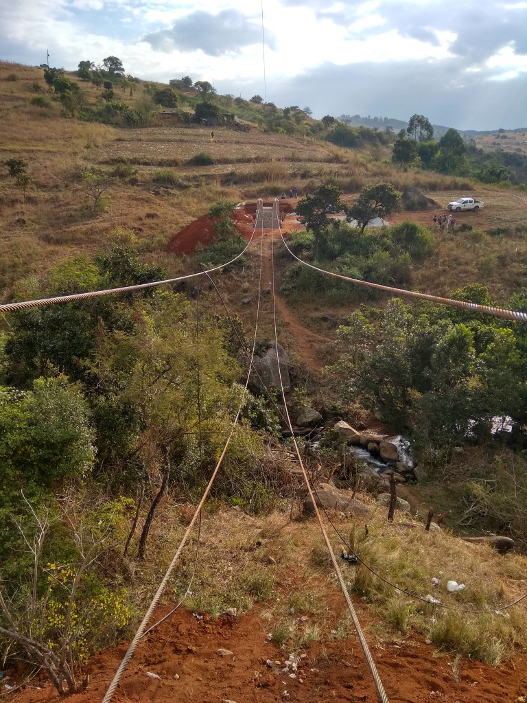
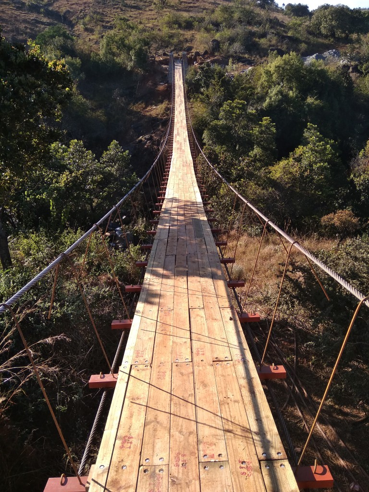

# Background

Back in the summer of 2018 as part of the Swaziland Footbridge Program, our CU chapter worked with a local community at Ndlembeni, to build an 83 meter suspended footbridge over the Nkomati river. Altogether it was a profound joyful experience for all those involved and was fully powered by the human spirit. Together we came together, overcome lots of challenges and endured hard work all with the common goal of a better future, and had lots of fun too.

Below is a series of updates sent out on a mailing list to individuals who had donated to fund our cause, to keep the folks updated and to share our gratitude. They detail all that went on during the project :)

# Update #1: Sanbonani y’all!!!

Our CUB2P bridge building crew is coming to you live from the other side of the Atlantic Ocean, in particular from the wonderful Kingdom of eSwatini (formerly known as Swaziland), where we are currently building a footbridge with the community of Endlembeni in the northwest part of the country.

It has been a whirlwind many days since we landed in Johannesburg with bright eyes and big plans for the coming weeks. And, all things considered, so far so good!!

Here's what has been happening so far on the trip!

Cruising down the M3 highway from Johannesburg to eSwatini is a rite of passage for eSwatini bridge builders, and for many of our team this was their first time in southern Africa. With loud upbeat music jamming on the minibus sound system, a plethora of new sights out the window, and a distinct smell of burning coal from all of the power plants, we were all full of excitement for what lay next.

Bright and early Monday morning we woke up, took a deep breath, and hit the road to meet with one of our partners in the country, Swaziland MicroProjects. MicroProjects is a parastatal organization that facilitates community development projects around the kingdom and is an essential partner in our projects.

MicroProjects provides the raw materials such as cement, crushed stone, and reinforcemnet used in our bridges and are a major advocate for us. They are also learning the process of bridge construction from us so that they may replicate it themselves, which is very cool.

We met with the director Mr. Mbingo who passionately thanked us for our work and bestowed much encouragement for our project. To have the support from MicroProjects is to have the wind at our back, and we are so grateful!

Beaming with resolve, we left the meeting and hit the road towards our bridge site. Just before sundown we turned from the paved road to a bumpy dirt one as we went along a ridge and made our way down to our bridge site.

As we bumped along slowly on that ole’ dirt road, it became clear that the place we’re building the bridge is just absolutely beautiful. Pictures won’t do justice the loveliness of these rolling hills peppered with quaint homestetads, but here’s a panorama nonetheless.

Towards the bottom of the hill our procession of eager bridge building students met a group of lovely hospitable community members with whom we would be staying. Together we arranged ourselves in a circle, the favourite shape of community projects, and made a round of introductions. From our circle it was clear we were working with a supportive community that very much desired a footbridge, and also to our delight there was a decent amount of English literacy among the community.

The Shongwe homestead had provided us with a hut for us to stay and soon we had made it our home, laying down copius amounts of sleeping pads and bags and soon we were all off to sleep. After months of bridge designing, fundraising, and planning, we were finally finally there.

During all our months of preparation for this trip, we were acutely aware that we were going to build a footbridge. That was the plan. But it ain’t real until it’s real, and I for one woke up Tuesday with the thought, “*eish*, now we have to build this thing!”

Have you ever built a 83-meter suspended footbridge? Guaranteed, It’s no small task. It involves a whole lot of foreplanning and heaps upon HEAPS of manual labour. But, considering the massive positive impact it has we believe it is well worth the effort.

The bridges we build consist of many parts including massive abutments from which the bridge's cables will hang. For these abutments as well as for the bridge anchors, we must do literally TONNES of excavation by hand.

Tonnes of excavation means tonnes of hard labour, and for the next many weeks we will work alongside community members pick axeing, digging, moving sand and rock, mixing concrete, more digging and more pick axeing, more moving sand and rock, and more mixing concrete.

The right side of our bridge is located in a repurposed farm field so the excavation there was cake as the land had been tilled many a time. In fact, the soil here is a thick cakey dark brown just like chocolate lava cake.

In no time we had excavated the land needed for the abutment foundation and the masons had made quick work of the foundation construction. However, as we began to unearth the soil for the left abutment excavation, we made a startling discovery.

A prehistoric dinosaur had laid many massive, solid granite eggs on the hillside right where our design had set our abutments and anchors to be. These rocks range from *hard to move* to **impossible to move** and present a huge problem for us.

It's not that the rocks must be moved out of the way of our foundations--in fact, we can incorporate these rocks into the bridge. The issue is that we must excavate to the required depth for our design and these boulders prevent us from excavating beneath them safely by hand.

Thus began a dilemma that left us to remove our hard hats to scratch our heads--dog gone, how on earth are we going to move these rocks? We don't have access to heavy machinery (and if we did we couldn't get it to such a steep site), and we were stumped for how to continue.

This led us to a discussion with the community--who better to ask about moving massive boulders that are common throughout eSwatini than the Swazis themselves?

Some community members suggested to set up a controlled burn involving wood and old tires underneath the rocks, and then afterwards to hit the rock with a sledgehammer and it would break right in half.

While we held a decent bit of skepticism for this method being effective, we nonetheless decided to give it a shot as it was our only feasable option. We implemented a safety plan for the burn including brush clearing, wetting down the surrounding grass, and having hoses and buckets at the ready, and one day after work gave it a shot.

To our delight it was very effective! If there are any physicists, chemists, or otherwise knowledgeable people in the audience that could shed light on how please let us know because we can't seem to agree about how it works.

Now in bite size pieces, we began the process of moving rocks, excavating beneath them, and then moving them back. And while I described that process in just one sentence let me tell you it is a huge task on the ground.

Though these big ole boulders have slowed our progress, on the contrary our spirit is thriving! We are learning all sorts of siSwati and making heaps of new friends on the job site, and laughing at least 20 times per day.

Here are a couple more pics from our time here on the site!

Thank you all so much for reading!! We are all having a blast here and do stay tuned for some more updates.

# Update #2 from eSwatini

## Sanbonani y'all!!

Once again our CUB2P footbridge building squad is coming to you live from the wicked neat, small landlocked monarchy in southern Africa known as eSwatini!! These last few weeks have been an arduous, fulfilling, and, all things considered, *kahle kakhulu*!!

Since the last update, our team has been continuing to work hard *every day* on completing the footbridge. Working alongside the Ndlembeni community, we are relentlessly progressing forward in our bridge build.

And, in light of many *interesting* challenges, we've had heaps of progress on our bridge!!

## Construction Update

Here in Swaziland they have a saying, *"kancane, kancane"*, "*bit by bit...*" as a way that things happen. Here our team embraces that as both a way of life and the way our bridge constrution goes, as *"bit by bit"* our bridge is getting complete!

Here's what we've been getting done on construction! 

### Right and left side towers

The mason at our bridge site is a lovely calm and patient older man named Mongisi and we are so happy to have him as a part of our bridge building family. He's a Swazi bricklayer whom we first worked with on the first Swaziland bridge last year at Edlangeni.

Mongisi made quick work of the left and right side towers, fuelled by buckets upon buckets of concrete mixed by other bridge family.

### Rock blasting

On our last update you heard about the *tonnes* of issues that we ran into on our left side excavation---absolutely **huge** rocks that our team needed to move but had no way of moving.

Our method of burning tires and smashing the rocks grew old after doing it twice---it's super toxic to do, tough to clean out, and most critically could burn down our centerline (a string suspended in the air which all of our bridge measurements are made off of, super important to keep stable).

Coming in to save the day, our in-country partner Swaziland Microprojects brought in experts with big drills and compressors, to blast the heck of the solid granite boulders.

Early one Saturday morning the guys came in with a massive, tractor pulled portable air compressor, drilled into the rocks and then drove a wedge into the holes, and cracked the rocks open like crazy.

To watch the rocks that had given us grief for *weeks* be effortlessly blasted away by modern machinery was pure satisfaction; there were many sighs of relief from the peanut gallery who assembled to watch the action.

Those sighs of relief quickly turned to noggin' scratching as we realized we still had to get these "no longer massive but still pretty big boulders" out of the hole. They were too heavy to lift by hands, but were up too steep an incline to roll, so *eish* how are we going to get these rocks out?

Our good ole' noggins got thinking once again as we discussed our options. Hmmm... we have a cable winch used to hoist the bridge cables, maybe we could try rig it up to lift the rocks out of the pit?

The Swazis also have another saying heard often: *"Why not?"*

And what do you know, **YebooooOOOO!!!!** it worked! So dope. (The dopest)

### Anchor excavations

Our left and right anchor excavations are like night and day:

The left side is like a pile of rocks with some dirt sprinkled around; the right side is cakey and soft with no rocks in sight. Needless to say, excavation on the right side has been pure bliss whereas the left side has been a rough time.

To excavate the little bits of dirt in between the big boulders is cumbersomeat best, to move these massive boulder fragments is troublesome, and to figure out how to incorporate the boulders in our bridge is a constant issue. But, we get it done :)

### Bridge cable layout

Once we dug out space for the anchor, cable paths, and abutment walls, we could finally preparev  our anchors on both sides. And this means it's time to cut and lay out our bridge cables!

The steel wire rope (cable) used in our bridge comes on massive spools that are hauled in on a truck with a hydraulic crane, and we've got to walk out the cables to the necessary lengths and cut it to size for our bridge.

Laying out and cutting bridge cables is a pretty fun day where everybody comes together and unspools, measures, and cuts the cable, and it's overall quite a silly experience.

From tower to tower our bridge is 83m, and our cables must be cut to 110m for the extra length from our towers to the anchor.

We walked out, cut, and then carried down the first second and third bridge cable no problem, like a breeze. But, when we were going to cut our last cable we made a *startling discovery*....

There wasn't enough rope on the spool for our fourth cable!! The cable we were using was what's leftover from our first bridge last year, and somehwhere along the way we had miscalculated how much cable we actually had left.

Unfortunately that was the last cable that our Swaziland program had in country and it wouldn't be for a many days until we could get our fourth cable.

*Eiiiiish...* When life gives you lemons, well... you know what to do. But what about when life throws you curveballs?

### Anchor pour

Welp, you dodge 'em!

We decided to pour our anchors with a small 4m section of cable in place of our big cable, then we when we get our big cable we can splice it to the small section and pull it through the plastic tubing and into place. 

And yebooooooo!!! Worked out great.

### Where we're at now

We're still waiting on our fourth cable to show up on site so we can hoist the cables and begin decking, when this thing starts to really look like a bridge!!

In the meantime, we're working on our left and right abutment wall excavation and build, which was originally planned to be after our cable hoisting but working on it now will allow us to relentlessly progress forward!

## Team update

We are tired, dirty, and happy.

7 weeks ago since we started our tebetebe here and, all things considered, it has been quite the ride. Projects like this are pretty out there to begin with, and for all of us it has been a reeeal experience in many unexpected ways.

One thing is for sure, is that this project has been pretty *strenuous*. Dawg, we're **out here** *onge emalanga* (every day) from sunrise to sunset, in one way or the other working wicked hard to build this *tebetebe*.

Sometimes that work means pouring anchors into the late evening, or waking up before sunrise to get an extra start for the day, or working pretty much every Saturday to make up for time lost due to various complications. Needless to say, this is no trivial exercise, and we go to bed at 9pmish every night exhausted.

One thing's fo sho, in spite of what are occasionally rough times, we've got eachother! What was once a CU bridge crew is now a CU bridge family --- we are now all ride or die homies and we always keep the up the *umoya* (spirit) and look after eachother.

Here in eSwatini people laugh *all the time* and we've taken to that way of life, taking note to take things lightheartedly and easy :)

Our bridge family is strong as we've gotten to be great friends with some of the community members that show up *onge emalanga* (every day). Homies like Papi, Steh, Joster, Alice, Tandiwe, Thobela, George, Mage Shongwe, Masego, .... brighten our days and we all have tons of fun as we figure this whole footbridge thing out together.

Truth be told, our daily experience here at the bridge site with the community is a great time itself, and we greatly enjoy spending time with our new fam sitting around the evening *umlilo* (fire), sharing good times and learning heaps of their Swazi wisdom, and laughing a lot.

And, every once in a while we get to leave the bridge site and do some fun things!! This past weekend we were invited to judge a bridge building competition at a Swazi high school science fair which was a grand ole' time.

One other amazing thing is that we're often now getting BEANS for lunch and sometimes even dinner! I frickin love beans.

From the whole team, we all send out immense love to our families who support us on this wild adventure!

### Behind the scenes

Behind every bridge building squad is a community of people, and we are grateful for our all of the support we have received both for this footbridge build and throughout the years. While our CU Boulder team is 7 strong, we wish to give a shoutout to those behind the scenes.

**Fun fact:** every bridge building crew have a group of professionals called bridge corps that help with our design and implementation of the footbridge.

In particular, we want to give a shout out to *mnaketfu* Bridge Corps Jabulo also known as Chris Busch, who out of his own free time came down to spend 2 weeks with us on site during our *critical construction* phase, and our other main *mnaketfu*, CUB2P bridge legend Harry McElroy for all of his help on bridge design.

We also must send out our utmost thanks to our debonair Program Manager Sam Vusi Sweet who has been such a great friend and mentor to our team throughout our bridge build process.

For those who don't know, it's a pretty wild and often complicated thing to build a footbridge in eSwatini, a job that takes navigating political and logistical hurdles, and Vusi is doing a great job at handling that for us, while being just a great presence in general.

We love you Vusi!!

**Another fun fact:** Our bridge building trips are sponsored largely through crowdfunding from people like yourself!! If you'd like to support righteous projects like these, please do so [here](https://giving.cu.edu/fund/cu-bridges-prosperity) or at the link at the bottom of the page!

If anyone would like to donate specifically to our bridge celebration, you can donate a goat to the celebration for $52.24 (R700), a round of cold beverages for $26.12 (R350), or a pack of "Polaroid" instant photos for $13.10. Please make sure to donate that exact amount so we can ensure your donation goes to the right place :)

### We love you all!! Thank you for reading!!

Stay tuned for our further updates as we charge to completion to the bridge!!

Hamba kahle y'all, siyabonga kakhulu!!

<3 from eSwatini

# Update #3: Sesicedzile (We Are Done!)

## Sanbonani everybody!!!

We are Finished!!!11!!! Yesterday was our last day on the bridge site and we are in a limbo zone now until we make our next move. It has been a total whirlwind the last many days and reality definitely has not sunk in yet!

Here are some images from these last couple days !!

# 2018 Ndlembeni Footbridge Inauguration

Thank you so much for staying along with us during this footbridge build!! It has been one heck of a time, a lifetime of memories.

See ya next year!!!
&lt;3